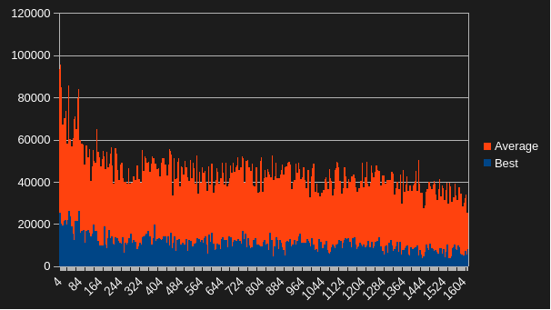

using the `--recursive` tag, clone this repo

if you already cloned and didn't recursively do `git submodule update --init --recursive`

build with `cmake -B build -G "GENERATOR"`
compile with `cmake --build build`

run with `./build/AiTest (.exe)`

use `left arrow` to switch training speed

